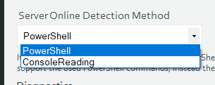
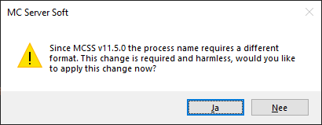
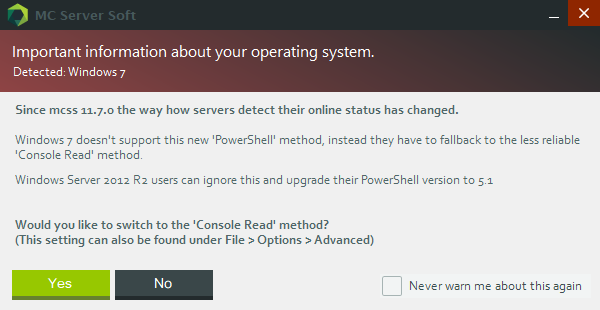
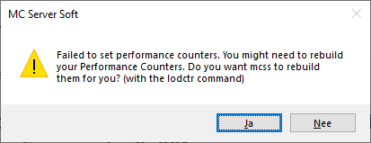
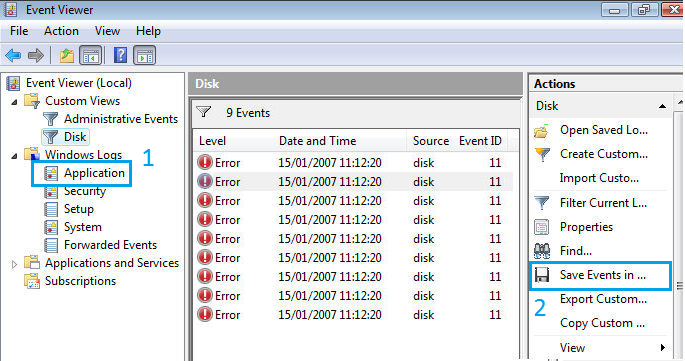
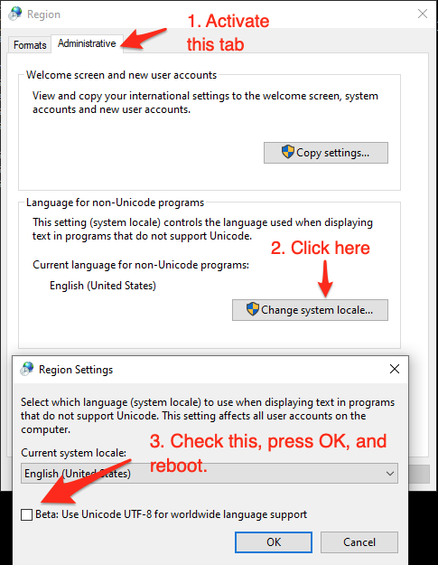

# FAQ

---

*   [Error occurred during initialization of VM Could not reserve enough space for 2097152KB object heap.](#error-occurred-during-initialization-of-vm)
*   [My server keeps saying starting.](#server-keeps-saying-starting)
*   [Unable to connect to the server.](#unable-to-connect-to-the-server)
*   [Is there a mac or linux version?](#is-there-a-mac-version)
*   [Is this 24/7?](#is-this-24-7)
*   [MCSS crashes when starting it.](#mcss-crashes-when-starting-it)
*   [Since v11.5.0 the process name requires a different format.](#process-name-different-format)
*   [Important information about your operating system.](#important-information-os)
*   [Failed to set performance counters.](#failed-to-set-performance-counters)
*   [I have this weird IP address: 2001:0db8:85a3:0000:0000:8a2e:0370:7334, is this normal?](#weird-ip-address)
*   [Updating from 10.4.0.0 or older fails.](#updating-from-10400-fails)
*   [Add (or update) the Java system path.](#add-update-java-path)
*   [Mcss has crashed and I want to help fix it.](#crashed-help-dev)
*   [The UTF-8 encoding doesn't work, I *really really* need it to work.](#utf-8)

## Error occurred during initialization of VM Could not reserve enough space for 2097152KB object heap.

You are likely missing the 64bit version of Java. It's either not installed or needs reinstalling.
Want to check if it's installed? Open a command prompt and type:
`java -d64 -version`

If it gives you an error, you don't have it installed. You can download it [here](https://java.com/en/download/windows-64bit.jsp).

## My server keeps saying starting.

If your server has actually started but mcss isn't detecting it then you can change the way how mcss detects online servers.

Go to `File > Options > Advanced` and change the default detection method to `ConsoleReading`.

## Unable to connect to the server.

As the server owner, try connecting with "localhost" (without the ""). 
Works? Great! This means there is nothing wrong with the actual server.

However if you want other people to be able to play on your server, you will need to port forward your ip.
[See section on Port forwarding](https://mcserversoft.github.io/documentation/port-forwarding).
 

## "Is there a mac or linux version?"

No unfortunately there isn't a version for mac. Mcss is Windows only. 
**Supported OSs**: Windows Server (2008R2 SP1/2012/2016), Windows 7, 8 and 10
 

## "Is this 24/7?"

No, it's software that runs on your computer. 
Nothing like Aternos.
 

## MCSS crashes when starting it.

Do you have [.NET Framework 4.7.2](https://dotnet.microsoft.com/download/dotnet-framework/net472) (or higher) installed?
 

## Since v11.5.0 the process name requires a different format.

This change is required, click 'Yes' to apply the change.

## Important information about your operating system.

Read the text in the dialog 😉

> It has been reported by other users that PowerShell can be upgraded on Windows Server 2012 R2 but Windows 7 users can not. Their best option is to switch to the 'Console Read' method. 

## Failed to set performance counters.

Your performance counters are corrupt. Mcss can automatically do this for you. Click "Yes" to fix it.

In case you want to do this manually:

Open a command prompt with administrator rights and execute the following commands:
 `cd c:\windows\system32`
 `lodctr /R`
 (if the lodctr command fails, simply run it twice)

> More info: [Microsoft Support | How to manually rebuild Performance Counter Library values
](https://support.microsoft.com/en-us/help/300956/how-to-manually-rebuild-performance-counter-library-values)
 

## "I have this weird IP address: 2001:0db8:85a3:0000:0000:8a2e:0370:7334, is this normal?"

Yes that is completely normal, that is called an IPv6 address. Most people don't have access to IPv6 yet so it's smart to share your IPv4 address instead.

There are 2 versions of the IP protocol.
 IPv4: 192.0.2.235
 IPv6: 2001:0db8:85a3:0000:0000:8a2e:0370:7334
 [More info about IPv6](https://www.networkworld.com/article/3254575/what-is-ipv6-and-why-aren-t-we-there-yet.html)
 
> FUN FACT: IPv6 doesn't have port forwarding, there are no internal and external IPs. Every computer has it's own public IP.

## Updating from 10.4.0.0 or older fails.

Due to backend api changes version 10.4.0.0 (and older) was considered End of Life (EOL) as of January 1st 2020.
Update from these old builds is no longer possible, they might even break.

You will need to update mcss manually. Download the latest version from the website and rename it to mcss.exe and copy'n replace it with the existing one. (make a backup just in case)

## "Add (or update) the Java system path."

> The PATH is the system variable that your operating system uses to locate needed executables from the command line or Terminal window.

1. Open an explorer window. Right-click on This PC and choose Properties.
2.  On the left, click the Advanced system settings link.
3. Click Environment Variables. In the section System Variables, find the PATH environment variable and select it. Click Edit. If the PATH environment variable does not exist, click New.
4. In the Edit System Variable (or New System Variable) window, specify the value of the PATH environment variable. Click OK. Close all remaining windows by clicking OK.
5. If you were using a Command prompt window, you will need to reopen that.
 *(The above steps were adapted from <https://www.java.com/en/download/help/path.xml>)*

## "Mcss has crashed and I want to help fix it."

To help fix it, you can upload your Windows event logs and mcss logs.
*(please zip all the files and send them to me by email, SpigotMC or Discord)*

To get the mcss logs:
> Mcss logs can be found in the mcss folder under /logs

To get the Windows event logs:
> Go to start and type eventvwr
You can follow the other steps on screenshot below.

## "The UTF-8 encoding doesn't work, I *really really* need it to work."

The sad reality is that UTF-8 is a second-class citizen in Windows.

As of Windows 10 version 1903, you have the option to set the system locale (language for non-Unicode programs) to UTF-8, but the feature is in beta.

To activate it:
*   Run `intl.cpl` (which opens the regional settings in Control Panel)
*   Follow the instructions in the screen shot below.

In some cases, the server needs to be started with additional parameters. E.g `-Dfile.encoding=UTF-8`, this varies from the server type used. More research is required on your end.

After setting this all up, this still doesn't guarantee that it will work. This just shows how bad the UTF-8 console support in Windows really is.

(sources)
*   <https://stackoverflow.com/a/57134096>,
*   <https://books.google.be/books?id=tkFPDwAAQBAJ&pg=PA436&lpg=PA436&dq=UTF-8+is+a+second-class+citizen+in+Windows&source=bl&ots=E9LdoNrGie&sig=ACfU3U0CaOrY_k5aj-tZ8xri76hgEAZ5Vw&hl=en&sa=X&ved=2ahUKEwja_vj00-DoAhVFDuwKHdBjAiwQ6AEwAHoECAsQKQ>
